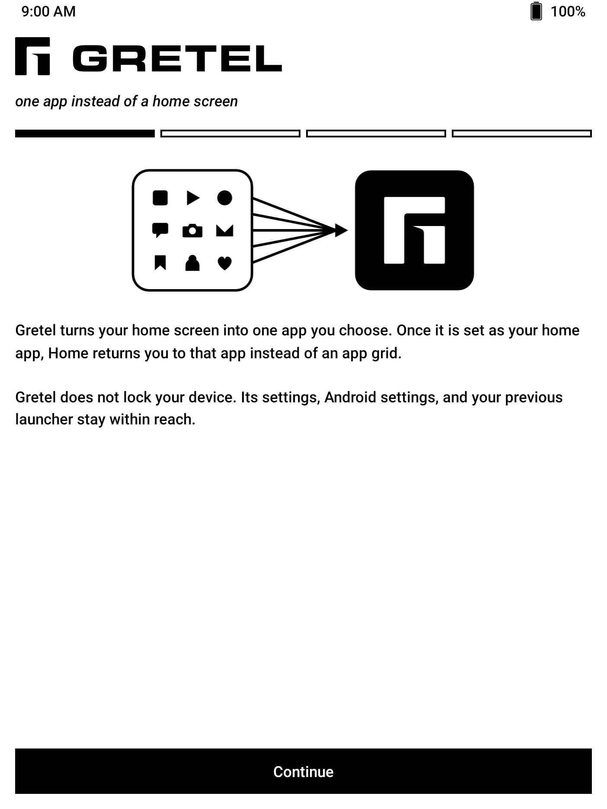
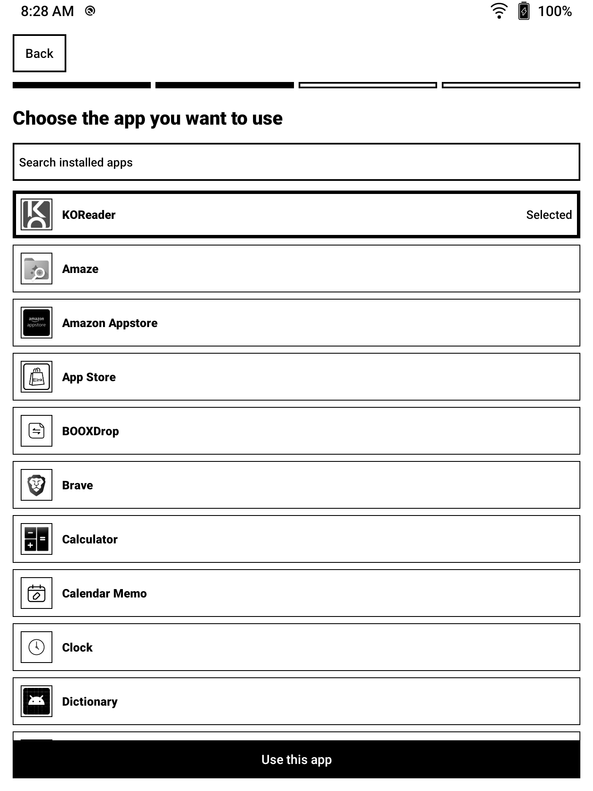
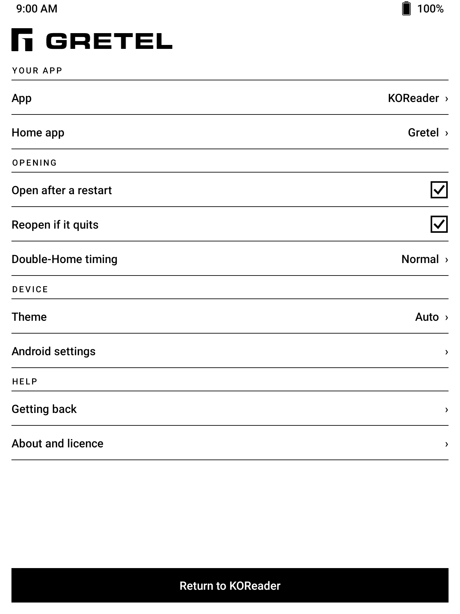

<p align="center">
  <picture>
    <source media="(prefers-color-scheme: dark)" srcset=".github/assets/gretel-lockup-dark.svg">
    <source media="(prefers-color-scheme: light)" srcset=".github/assets/gretel-lockup.svg">
    
  </picture>
</p>

<p align="center"><strong>The anti-launcher. Your home screen is one app.</strong></p>

<p align="center"><a href="https://abeant.github.io/gretel/">abeant.github.io/gretel</a></p>

<p align="center">
  <a href="https://github.com/abeant/gretel/actions/workflows/ci.yml"></a>
  <a href="https://github.com/abeant/gretel/releases/latest"></a>
  <a href="https://github.com/abeant/gretel/releases"></a>
  
  <a href="LICENSE"></a>
  
</p>

<!--
Add these once each channel is live:
<a href="https://f-droid.org/packages/com.abeant.gretel/"></a>
<a href="https://play.google.com/store/apps/details?id=com.abeant.gretel"></a>
-->

Every Android launcher hands you a grid of apps and asks you to choose again, every time you press Home. Gretel asks once.

Pick the app you actually want to use, make Gretel your home app, and that app becomes the place your device always returns to. No grid, no feed, nothing else competing for your attention. Press Home twice quickly and Gretel's settings appear, so you are never stuck.

It was built for e-readers, where KOReader or another reading app should simply *be* the device. It works just as well on a spare phone or tablet you want to turn into a single-purpose tool.

<p align="center">
  
  
  
</p>
<p align="center"><sub>Captured on a BOOX Nova Air.</sub></p>

## Install

<a href="https://github.com/abeant/gretel/releases/latest"></a>

1. Download `gretel.apk` from [Releases](https://github.com/abeant/gretel/releases/latest) and open it on your Android device. If Android asks, allow your browser or file manager to install unknown apps.
2. Open Gretel and choose the app you want to use.
3. Follow the prompt to set Gretel as your home app.

Verify the download against `SHA256SUMS` in the same release if you want to confirm the file is intact.

That is it. Home once returns you to your chosen app. Home twice quickly opens Gretel's settings. If the second press keeps missing, pick a more relaxed double-Home timing in settings.

Gretel is also headed to F-Droid. Watch [Releases](https://github.com/abeant/gretel/releases) or star the repo to hear about it.

## What it does

- **One chosen app replaces the home screen.** Your Home button or gesture opens it, every time.
- **Your app stays in front.** Gretel can bring it back after a restart or when the app exits. Both behaviors are optional, and if the app keeps crashing Gretel stops reopening it and shows settings instead.
- **Settings are always within reach.** Home twice quickly opens Gretel instead of your chosen app.
- **Designed for e-ink.** High-contrast black-and-white screens, large targets, no ripples, no animation. Every screen is paged, never scrolled, and e-reader page buttons turn the pages.
- **Private by construction.** No account, ads, analytics, network permission, or broad package visibility.
- **Easy to undo.** Choose another home app in Android settings, or uninstall Gretel like any other app.
- **English and Spanish.** Android follows the device language automatically. Android 13 and newer also expose Gretel in per-app language settings.

## Use cases

Gretel was built for e-readers, where a reading app such as KOReader should simply *be* the device. The same trick turns any spare phone or tablet into a single-purpose tool. Pick the app, install Gretel, done.

| Category | Use case | The device becomes | Start with (F-Droid) |
|---|---|---|---|
| Read and write | E-reader | A book. Home returns to the reader, every time. | [KOReader](https://f-droid.org/packages/org.koreader.launcher.fdroid/), [Librera](https://f-droid.org/packages/com.foobnix.pro.pdf.reader/) |
| Read and write | Read-later device | Your saved articles and feeds, without a feed. | [wallabag](https://f-droid.org/packages/fr.gaulupeau.apps.InThePoche/), [Feeder](https://f-droid.org/packages/com.nononsenseapps.feeder/) |
| Read and write | Writing deck | A tablet and a Bluetooth keyboard become a typewriter. | [Markor](https://f-droid.org/packages/net.gsantner.markor/) |
| Read and write | Paper notebook | An e-ink tablet that opens straight to a blank page. | [Saber](https://f-droid.org/packages/com.adilhanney.saber/) |
| Read and write | Scripture | A device that opens to the text, nothing else. | [AndBible](https://f-droid.org/packages/net.bible.android.activity/) |
| Focus | Study cards | An old tablet becomes a deck of flashcards. | [AnkiDroid](https://f-droid.org/packages/com.ichi2.anki/) |
| Focus | Sleep phone | The bedroom phone is an alarm clock or white noise, and cannot be anything else. | [Fossify Clock](https://f-droid.org/packages/org.fossify.clock/), [Noice](https://f-droid.org/packages/com.github.ashutoshgngwr.noice/) |
| Focus | Habit tracker | One screen, one question: did you do it today? | [Loop Habit Tracker](https://f-droid.org/packages/org.isoron.uhabits/) |
| Focus | Dumbphone | A spare phone that only makes calls or only sends texts. | [Fossify Phone](https://f-droid.org/packages/org.fossify.phone/), [Fossify Messages](https://f-droid.org/packages/org.fossify.messages/) |
| Family | Grandparent's phone | Opens to video calls. If they get lost, Home brings the calls back. | [Jitsi Meet](https://f-droid.org/packages/org.jitsi.meet/), [Linphone](https://f-droid.org/packages/org.linphone/) |
| Family | Kid's audiobook player | An old phone with stories and no store. | [Voice](https://f-droid.org/packages/de.ph1b.audiobook/) |
| House | Wall dashboard | A Home Assistant tablet without kiosk software. | [Home Assistant](https://f-droid.org/packages/io.homeassistant.companion.android.minimal/) |
| House | Kitchen tablet | Recipes at the counter. | [Nextcloud Cookbook](https://f-droid.org/packages/de.micmun.android.nextcloudcookbook/) |
| House | Family calendar | A shared calendar on the wall. | [Fossify Calendar](https://f-droid.org/packages/org.fossify.calendar/) |
| House | Photo frame | A slideshow on a tablet you no longer use. | [Fossify Gallery](https://f-droid.org/packages/org.fossify.gallery/) |
| Outdoors | Car or bike GPS | Offline maps on a mounted phone. | [OsmAnd](https://f-droid.org/packages/net.osmand.plus/), [Organic Maps](https://f-droid.org/packages/app.organicmaps/) |
| Outdoors | Field and survival kit | Compass, weather, astronomy, and navigation, all offline. | [Trail Sense](https://f-droid.org/packages/com.kylecorry.trail_sense/) |
| Outdoors | Night sky | A phone that opens to the stars. | [Sky Map](https://f-droid.org/packages/com.google.android.stardroid/) |
| Outdoors | Run and ride tracker | A dedicated GPS logger. | [OpenTracks](https://f-droid.org/packages/de.dennisguse.opentracks/) |
| Hobbies | Music player | An old phone becomes an iPod again. | [Auxio](https://f-droid.org/packages/org.oxycblt.auxio/) |
| Hobbies | Podcast player | Podcasts and nothing else. | [AntennaPod](https://f-droid.org/packages/de.danoeh.antennapod/) |
| Hobbies | Practice room | A metronome on the music stand. | [Metronome](https://f-droid.org/packages/de.moekadu.metronome/) |
| Hobbies | Chess board | Chess on e-ink. | [DroidFish](https://f-droid.org/packages/org.petero.droidfish/) |
| Hobbies | Crossword book | A puzzle book that never runs out. | [Forkyz](https://f-droid.org/packages/app.crossword.yourealwaysbe.forkyz/) |
| Hobbies | Game console | An old phone with a controller clip. | [RetroArch](https://f-droid.org/packages/com.retroarch/) |
| Hobbies | Camera | A point-and-shoot for a kid, or for you. | [Open Camera](https://f-droid.org/packages/net.sourceforge.opencamera/) |
| Hobbies | Travel translator | A spare phone for the trip. | [Translate You](https://f-droid.org/packages/com.bnyro.translate/) |
| Work | Barcode scanner | A scanner for the stockroom. | [Binary Eye](https://f-droid.org/packages/de.markusfisch.android.binaryeye/) |
| Work | Paper terminal | An e-ink tablet, a keyboard, and a shell. | [Termux](https://f-droid.org/packages/com.termux/) |

Gretel does not keep the screen on and does not lock anything. For a dashboard or photo frame, use the app's own keep-awake setting or Android's "Stay awake while charging" developer option. If you built something that is not listed here, [open an issue](https://github.com/abeant/gretel/issues) and it can join the table.

## For digital minimalists

A minimal launcher still shows you a list. A list is still a menu, and a menu is still a decision. Gretel removes the menu. Your device opens to the one thing you brought it for, and Home takes you back there, not to a place where other things can ask for you.

It is not a lock. Locks invite you to test them. Gretel is a default, and defaults are what change behaviour. Everything stays one settings screen away, so you never feel trapped, and never need to.

## How it compares

| | Stock launcher | Minimal launchers | Kiosk / MDM apps | **Gretel** |
|---|---|---|---|---|
| Home opens | An app grid | A short app list | A locked app | **The one app you chose** |
| Choices per Home press | Many | A few | None | **None** |
| Reversible by the user | Yes | Yes | No | **Yes** |
| Device Admin, Accessibility, or overlays | No | Sometimes | Yes | **Never** |
| Built for e-ink | No | Rarely | No | **Yes** |
| Network permission | Usually | Sometimes | Yes | **None** |

> Gretel is not a kiosk or parental-control app. It is intentionally reversible and does not use Device Admin, Accessibility, overlays, or lock task mode. If you need to stop someone from leaving an app, Gretel is the wrong tool.

## Compatibility

| Item | Detail |
|---|---|
| Android | 8.0 Oreo or newer |
| Architectures | Any architecture supported by Android. Gretel contains no native code. |
| Tested on | BOOX Nova Air, Android 10. Every release is installed and exercised on that device. |
| Package | `com.abeant.gretel` |
| Size | Under 1 MB, no bundled SDKs, no native code |

Android handles the home-app selection. Gretel cannot and does not make itself the default without your confirmation. Device manufacturers sometimes move that setting. If the normal prompt does not appear, open **Settings, Apps, Default apps, Home app**.

## Questions

**Does it lock the device?**
No. Gretel is a home app, not a cage. Android settings, your previous launcher, and Gretel's own settings all stay reachable.

**Why not just use a minimal launcher?**
Olauncher, Niagara, and the like shrink the app grid to a short list. Gretel deletes it. If you only ever want one app on a device, there is nothing left to choose from and nothing left to resist.

**How do I get back to Gretel once my app is in front?**
Press Home twice quickly. That opens Gretel's settings instead of your chosen app.

**What if I uninstall the app I chose?**
Gretel notices and offers to pick a different one instead of leaving you on a blank screen.

**Does it run in the background or drain the battery?**
No. There is no foreground service, persistent notification, boot receiver, alarm, or wake lock. Gretel only runs when Android delivers a Home press.

**Does it work on a Kindle?**
No. Amazon's Fire tablets and Kindle e-readers do not expose Android's home-app setting. Gretel needs a device where that setting is available, which covers BOOX, most other Android e-readers, and ordinary phones and tablets.

**Can I switch back?**
Any time. Open **Settings, Apps, Default apps, Home app** and pick another launcher, or just uninstall Gretel.

## Privacy

Gretel collects nothing and has no internet permission. Your chosen app and preferences stay on the device. See the complete [privacy policy](PRIVACY.md).

## Build from source

You will need JDK 17 and the Android SDK 36 platform and build tools.

```bash
./gradlew :app:lintDebug :app:testDebugUnitTest :app:assembleDebug
```

The debug APK is written to `app/build/outputs/apk/debug/app-debug.apk`.

Every `v*` tag builds a signed APK and Android App Bundle, verifies the APK signature, generates checksums, and publishes the files in a GitHub Release.

Contributions are welcome. Read [CONTRIBUTING.md](CONTRIBUTING.md) before opening a pull request.

## Licence

Gretel is available under the [Apache License 2.0](LICENSE).

<p align="center"><sub>If Gretel makes your device quieter, a star helps other people find it.</sub></p>
